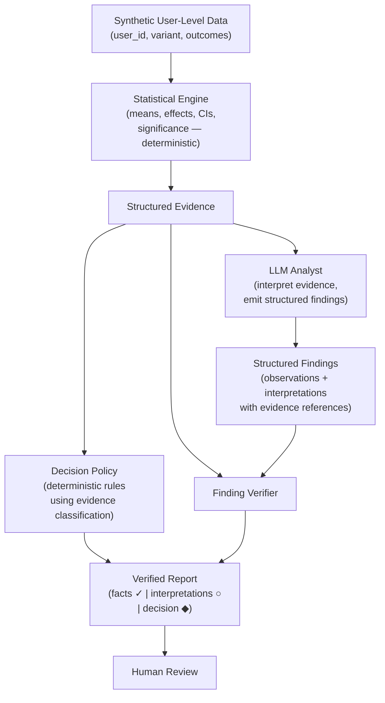

# ExperimentMind — V1 Build Specification

## Product Thesis

Experiment analysis has a trust problem. When an LLM interprets A/B test results, the user cannot distinguish computed facts from generated narrative. ExperimentMind makes the boundary visible:

- **Statistics are computed by code.** The LLM never calculates treatment effects, p-values, or confidence intervals.
- **Decisions follow explicit rules.** A deterministic policy maps evidence patterns to recommendations. The LLM explains the decision; it does not invent it.
- **Interpretation is labeled and checked.** The LLM produces structured findings that explicitly cite their evidence. Each finding is verified before the user sees it.

The result is an experiment analysis where facts, interpretations, and decisions are visibly separated — and the user knows which is which.

## User Problem

Product teams run controlled experiments and need to decide: ship, don't ship, or collect more data. An analyst must interpret dozens of metrics, trace mechanisms, weigh tradeoffs, and make a recommendation.

Asking an LLM to do this end-to-end fails silently:

- It hallucinates numbers that look authoritative but don't match the data
- It presents hypotheses as established facts
- It cherry-picks metrics that support a clean narrative
- It produces recommendations disconnected from the evidence pattern
- The user has no way to know which parts to trust

ExperimentMind separates the trustworthy parts (statistics, decision rules) from the judgment parts (interpretation) and makes the boundary explicit.

## V1 Architecture



### Component Responsibilities

**Synthetic Data Generator.** Produces realistic user-level experiment observations for the demo scenario. Each row represents one user session: user ID, variant assignment, and outcome columns (converted, revenue, shipping cost incurred). The generator uses configurable group-level parameters (e.g., control conversion rate, treatment lift) plus random noise, so the resulting statistics are realistic but known in advance for testing.

**Statistical Engine.** Computes experiment metrics from the raw observations using standard methods:

- Group means or rates (control vs. treatment)
- Absolute and relative treatment effects
- Confidence intervals (e.g., via normal approximation or bootstrap)
- Two-sample hypothesis tests (e.g., t-test for continuous, z-test for proportions)
- Sample sizes per group

Uses scipy.stats or statsmodels — no custom statistical implementations. The output is a structured `Evidence` object. This component is pure Python with no LLM involvement.

**Structured Evidence.** An immutable Python object holding every computed metric result. This is the single source of truth. The LLM receives it as formatted input. The verifier checks findings against it. No component downstream may alter it.

**Evidence Classification.** Each metric result is classified into one of four categories based on the effect estimate, confidence interval, metric direction, and an optional decision threshold representing the smallest effect that would materially change the product decision.

| Classification | Criteria |
|---|---|
| **CLEARLY_POSITIVE** | Effect is in the favorable direction, statistically significant, AND (if a decision threshold is specified) the point estimate exceeds it |
| **CLEARLY_NEGATIVE** | Effect is in the unfavorable direction, statistically significant, AND (if a decision threshold is specified) the point estimate exceeds it |
| **NEGLIGIBLE** | Either: (a) significant but the effect is smaller than the decision threshold, meaning it is real but too small to matter; or (b) not significant and the entire confidence interval falls within the decision threshold bounds, meaning we can confidently rule out a meaningful effect |
| **UNCERTAIN** | Not significant and the confidence interval extends beyond the decision threshold, meaning the data cannot distinguish between "no meaningful effect" and "meaningful effect that we lack power to detect" |

When no decision threshold is provided, the classification falls back to significance alone: significant-favorable → CLEARLY_POSITIVE, significant-unfavorable → CLEARLY_NEGATIVE, not significant → UNCERTAIN.

This classification is computed deterministically as part of the Evidence and used by the decision policy. Its purpose is to prevent the failure mode where `p < 0.05 → ship` becomes the decision rule, ignoring whether the detected effect is large enough to matter or whether a non-significant result reflects genuine absence of effect vs. insufficient power.

**Decision Policy.** A small deterministic function that maps the evidence classification pattern to a recommendation. It examines:

- The evidence classification of each primary metric
- The evidence classification of each guardrail metric

The policy returns a recommendation and a structured rationale (which rules fired and why). The LLM never participates in this computation.

Decision rules (designed from first principles for a generic product experiment):

| Primary Metrics | Guardrails | Recommendation |
|---|---|---|
| All CLEARLY_POSITIVE | All CLEARLY_POSITIVE, NEGLIGIBLE, or UNCERTAIN | **SHIP** |
| At least one CLEARLY_POSITIVE, none CLEARLY_NEGATIVE | At least one CLEARLY_NEGATIVE | **TRADEOFF — requires human review** |
| At least one CLEARLY_NEGATIVE | Any | **DO NOT SHIP** |
| All NEGLIGIBLE | All non-negative | **DO NOT SHIP** (effect is real but too small to justify the change) |
| Any UNCERTAIN, none CLEARLY_NEGATIVE | All non-negative | **COLLECT MORE DATA** |
| Any UNCERTAIN, none CLEARLY_NEGATIVE | At least one CLEARLY_NEGATIVE | **DO NOT SHIP** |
| Mixed (CLEARLY_POSITIVE + CLEARLY_NEGATIVE) | Any | **TRADEOFF — requires human review** |

Note: guardrail metrics are evaluated directionally — a guardrail is "negative" when it moves in the unfavorable direction (e.g., costs increasing when lower is better), regardless of whether the absolute effect is positive or negative.

**LLM Analyst.** Receives:

- The structured evidence (formatted as a readable summary in the prompt)
- The experiment specification (hypothesis, what changed, success criteria)
- Instructions to produce structured findings (not free-form prose)

Produces a list of structured findings, each containing:

```
{
  "statement": "Conversion rate increased by 6.5%, which is statistically significant.",
  "type": "observation",
  "evidence_refs": ["conversion_rate"]
}
```

and

```
{
  "statement": "The conversion increase likely comes from price-sensitive users 
                who previously abandoned carts due to shipping costs.",
  "type": "interpretation",
  "evidence_refs": ["conversion_rate", "cart_abandonment_rate"]
}
```

The LLM also produces a narrative summary that synthesizes the findings into a coherent story, but the findings are the primary output — the narrative is secondary.

The key architectural constraint: the LLM is asked to produce structured output (via tool use / function calling or a JSON-mode response) rather than free-form text that must be parsed after the fact.

**Finding Verifier.** Receives both the list of structured findings and the Evidence object. Checks each finding against the evidence.

For findings of type `observation`:
- Do all referenced metrics exist in the evidence?
- Does the stated effect magnitude match (within rounding tolerance)?
- Does the stated significance match?
- Does the stated direction match?
- Verdict: **VERIFIED** (all checks pass) or **INCORRECT** (any check fails) or **UNRESOLVED** (referenced metric not found in evidence)

For findings of type `interpretation`:
- Do all referenced metrics exist in the evidence?
- Does the interpretation contradict the observed direction of any referenced metric?
- Does the interpretation introduce concepts not present in the evidence (e.g., asserting "profitability" when the evidence contains revenue and cost but not profit)?
- Verdict assignment:
  - **CONSISTENT_WITH_EVIDENCE**: All referenced metrics exist, and the stated relationships do not contradict observed directions. *This does not mean the interpretation is causally established — it means only that the available evidence does not contradict it.*
  - **CONTRADICTED_BY_EVIDENCE**: At least one referenced metric's observed direction is inconsistent with the interpretation's assertion.
  - **INSUFFICIENT_EVIDENCE**: The interpretation references metrics not in the evidence, or introduces unobserved concepts that cannot be assessed from the available data.

The verifier is deliberately conservative. An interpretation that is plausible but references a concept the evidence cannot speak to receives INSUFFICIENT_EVIDENCE, not CONSISTENT_WITH_EVIDENCE. The purpose is not to validate causal stories but to ensure the user knows what has and has not been checked.

The verifier never attempts to prove causation. It enforces one boundary: interpretations must not contradict the computed evidence, and must not claim support from evidence that does not exist.

**Report Renderer.** Combines:
- The verified findings (each annotated with its verification status)
- The decision policy output (recommendation + rationale, including evidence classifications)
- A verification summary (counts of verified/incorrect/consistent/insufficient)
- The LLM's narrative summary (with a note that it is AI-generated interpretation)

Outputs: formatted Markdown suitable for terminal display or notebook rendering.

## Data Model

```python
from dataclasses import dataclass

@dataclass
class MetricSpec:
    metric_name: str
    higher_is_better: bool
    decision_threshold: float | None = None  # smallest meaningful relative effect

@dataclass
class ExperimentSpec:
    name: str
    hypothesis: str
    primary_metrics: list[str]
    guardrail_metrics: list[str]
    success_criteria: str
    metric_specs: dict[str, MetricSpec]      # metric_name -> spec with direction + threshold

@dataclass
class MetricResult:
    metric_name: str
    control_mean: float
    treatment_mean: float
    absolute_effect: float
    relative_effect: float                   # as a proportion, e.g., 0.068 = +6.8%
    ci_lower: float                          # CI on relative effect
    ci_upper: float
    p_value: float
    significant: bool                        # at specified alpha
    sample_size_control: int
    sample_size_treatment: int
    classification: str                      # "clearly_positive", "clearly_negative",
                                             # "negligible", "uncertain"

@dataclass
class Evidence:
    experiment: ExperimentSpec
    metrics: dict[str, MetricResult]         # keyed by metric_name
    alpha: float                             # significance threshold used

@dataclass
class Finding:
    statement: str
    finding_type: str                        # "observation" or "interpretation"
    evidence_refs: list[str]                 # metric names referenced

@dataclass
class VerifiedFinding:
    finding: Finding
    status: str                              # observations: "verified", "incorrect", "unresolved"
                                             # interpretations: "consistent_with_evidence",
                                             #   "contradicted_by_evidence", "insufficient_evidence"
    details: str                             # explanation of verification result

@dataclass
class Recommendation:
    action: str                              # "ship", "do_not_ship", "tradeoff", "collect_more_data"
    rationale: list[str]                     # which rules fired
    primary_evidence: dict[str, str]         # metric -> classification
    guardrail_evidence: dict[str, str]       # metric -> classification
```

## Repository Structure

```
experimentmind/
├── README.md
├── pyproject.toml
├── experimentmind/
│   ├── __init__.py
│   ├── data.py              # ExperimentSpec, MetricResult, Evidence, Finding, etc.
│   ├── stats.py             # Statistical engine: raw observations → Evidence
│   ├── policy.py            # Decision policy: Evidence → Recommendation
│   ├── analyst.py           # LLM analyst: Evidence + Spec → list[Finding]
│   ├── verifier.py          # Finding verifier: (Findings, Evidence) → list[VerifiedFinding]
│   ├── report.py            # Report renderer: VerifiedFindings + Recommendation → Markdown
│   └── synthetic.py         # Synthetic data generator for the demo experiment
├── tests/
│   ├── test_stats.py        # Statistical engine correctness + evidence classification
│   ├── test_policy.py       # Decision policy: known inputs → expected outputs
│   ├── test_verifier.py     # Verifier: known findings → expected verdicts
│   └── test_end_to_end.py   # Full pipeline on synthetic data
├── demo.ipynb               # End-to-end walkthrough with commentary
└── examples/
    └── shipping_threshold.json   # Experiment spec for the demo scenario
```

## End-to-End Demo

### Scenario: Free Shipping Threshold ($50 → $35)

An e-commerce company tests whether lowering the free shipping threshold from $50 to $35 increases revenue. The experiment runs for 3 weeks with user-level randomization.

**Why this scenario**: It creates a genuine tradeoff. More users convert (good), but they spend less per order (bad) and shipping costs rise (guardrail risk). The primary revenue metric is likely to be inconclusive because opposing effects partially cancel. This forces the system to handle ambiguity rather than rubber-stamping a clean positive result.

### Synthetic data design

The data generator creates ~20,000 synthetic user sessions (10,000 per variant). Each session represents one user visit. A user may or may not convert (purchase). If they convert, the session has a revenue amount and a shipping cost. One session produces at most one order, so conversion rate is the only purchase-frequency metric (no separate order count that would duplicate it).

Approximate parameters:

| Metric | Control | Treatment | True Effect | Decision Threshold |
|---|---|---|---|---|
| Conversion rate | ~3.2% | ~3.4% | +6.5% relative | ±2% |
| Revenue per session | ~$1.85 | ~$1.87 | +1.2% relative (noisy) | ±1% |
| Avg order value (among converters) | ~$58 | ~$55 | -5.1% relative | ±3% |
| Shipping cost per order (among converters) | ~$4.80 | ~$5.40 | +12.3% relative | ±5% |
| Cart abandonment rate | ~22% | ~20% | -8.2% relative (lower is better) | ±3% |

Each user session is generated from: variant assignment → conversion draw (Bernoulli) → if converted: revenue draw (log-normal), shipping cost draw (conditional on revenue vs. threshold).

The parameters are tuned so that:
- Revenue per session is NOT statistically significant (positive and negative effects roughly cancel), AND its CI extends beyond the ±1% decision threshold → classified UNCERTAIN
- Conversion rate is significant and exceeds its decision threshold → classified CLEARLY_POSITIVE
- Avg order value is significant negative and exceeds its threshold → classified CLEARLY_NEGATIVE
- Shipping cost per order is significant unfavorable and exceeds its threshold → classified CLEARLY_NEGATIVE (guardrail)
- Cart abandonment is significant favorable → classified CLEARLY_POSITIVE

This makes the decision genuinely hard: the primary metric (revenue per session) is uncertain, a secondary primary (conversion rate) is clearly positive, but a guardrail (shipping cost) is clearly negative.

### Demo walkthrough

**Step 1 — Generate data and compute statistics.**

```
$ python -m experimentmind.demo --seed 42

Computing experiment statistics...

  Metric                  Effect    95% CI              Sig?   Classification
  ─────────────────────── ──────    ──────────────────  ────   ──────────────
  conversion_rate         +6.5%    [+3.1%, +9.9%]      yes    CLEARLY_POSITIVE
  revenue_per_session     +1.2%    [-1.4%, +3.8%]      no     UNCERTAIN
  avg_order_value         -5.1%    [-7.9%, -2.3%]      yes    CLEARLY_NEGATIVE
  shipping_cost_per_order +12.3%   [+8.1%, +16.5%]     yes    CLEARLY_NEGATIVE ⚠
  cart_abandonment_rate   -8.2%    [-12.8%, -3.6%]      yes    CLEARLY_POSITIVE
```

**Step 2 — Decision policy.**

```
Decision Policy:
  revenue_per_session (primary):     UNCERTAIN
  conversion_rate (primary):         CLEARLY_POSITIVE
  shipping_cost_per_order (guardrail): CLEARLY_NEGATIVE

  Rule: primary mixed (positive + uncertain), guardrail clearly negative
        → TRADEOFF — requires human review

  Recommendation: TRADEOFF
  Rationale: Conversion rate shows a clearly positive effect, but the
  primary revenue metric is uncertain and the shipping cost guardrail
  is clearly negative. Human judgment is needed to weigh whether the
  conversion gains justify the cost increase.
```

**Step 3 — LLM analysis (structured findings).**

```
Finding 1 [observation]:
  "Conversion rate increased by 6.5%, which is statistically significant
  and exceeds the 2% decision threshold."
  Evidence: conversion_rate
  → VERIFIED ✓

Finding 2 [observation]:
  "Revenue per session changed by +1.2%, but this is not statistically
  significant. The confidence interval [-1.4%, +3.8%] spans the ±1%
  decision threshold, so a meaningful effect cannot be ruled out."
  Evidence: revenue_per_session
  → VERIFIED ✓

Finding 3 [observation]:
  "Shipping cost per order increased by 12.3%, a statistically significant
  increase that violates the guardrail."
  Evidence: shipping_cost_per_order
  → VERIFIED ✓

Finding 4 [interpretation]:
  "Users no longer need to add extra items to reach the $50 threshold,
  which likely explains the lower average order value."
  Evidence: avg_order_value, conversion_rate
  → CONSISTENT WITH EVIDENCE ○
  (avg_order_value decreased, conversion_rate increased — directions
  are compatible with this explanation. Causal mechanism not established.)

Finding 5 [interpretation]:
  "The shipping cost increase may erode margins enough to make the
  conversion gains unprofitable."
  Evidence: shipping_cost_per_order, revenue_per_session
  → INSUFFICIENT EVIDENCE ○
  (Profitability is not measured in the experiment. The interpretation
  introduces an unobserved concept — margin — that cannot be assessed
  from the available evidence.)
```

**Step 4 — Verified report.**

```
═══════════════════════════════════════════════════════════
 EXPERIMENTMIND — Free Shipping Threshold ($50 → $35)
═══════════════════════════════════════════════════════════

EVIDENCE (computed deterministically)
─────────────────────────────────────
  conversion_rate         +6.5%   [+3.1%, +9.9%]    CLEARLY_POSITIVE
  revenue_per_session     +1.2%   [-1.4%, +3.8%]    UNCERTAIN
  avg_order_value         -5.1%   [-7.9%, -2.3%]    CLEARLY_NEGATIVE
  shipping_cost_per_order +12.3%  [+8.1%, +16.5%]   CLEARLY_NEGATIVE ⚠ GUARDRAIL
  cart_abandonment_rate   -8.2%   [-12.8%, -3.6%]    CLEARLY_POSITIVE

FINDINGS (AI-generated, individually verified)
──────────────────────────────────────────────
  ✓ VERIFIED              Conversion rate increased significantly,
                          exceeding the decision threshold.
  ✓ VERIFIED              Revenue per session is uncertain — a
                          meaningful effect cannot be ruled out.
  ✓ VERIFIED              Shipping cost per order increased
                          significantly (guardrail violated).
  ○ CONSISTENT            Lower threshold may reduce incentive to
                          add items, explaining the AOV decline.
                          (Not causally established.)
  ○ INSUFFICIENT EVIDENCE Margin erosion claim introduces profitability,
                          which is not measured in this experiment.

  Verification: 3/3 observations verified ✓
                1 interpretation consistent with evidence ○
                1 interpretation has insufficient evidence ○

RECOMMENDATION (deterministic policy)
─────────────────────────────────────
  ◆ TRADEOFF — requires human review

  Primary evidence:
    conversion_rate:     CLEARLY_POSITIVE
    revenue_per_session: UNCERTAIN

  Guardrail evidence:
    shipping_cost_per_order: CLEARLY_NEGATIVE

  The conversion lift is real and meaningful, but the revenue impact
  is uncertain and shipping costs increased materially. Consider:
  - Would a longer experiment resolve the revenue uncertainty?
  - Can the shipping cost increase be mitigated operationally?
  - Is the conversion lift valuable independent of per-session revenue?

═══════════════════════════════════════════════════════════
```

## Evaluation (V1)

V1 uses normal tests, not an evaluation framework.

**Statistical engine tests** (`test_stats.py`):
- Given known synthetic data with a known seed, verify that computed effects, CIs, and significance match expected values (within floating-point tolerance).
- Test evidence classification: given effect, CI, direction, and decision threshold, verify the correct classification (CLEARLY_POSITIVE / CLEARLY_NEGATIVE / NEGLIGIBLE / UNCERTAIN) for each combination.
- Edge cases: zero-variance group, single-observation group, no conversions in one group, effect exactly at threshold boundary.

**Decision policy tests** (`test_policy.py`):
- Enumerate the policy's input space (primary classifications × guardrail classifications) and verify each combination produces the expected recommendation.
- This is a small truth table — exhaustive testing is feasible.
- Specific test: a significant but sub-threshold effect should be classified NEGLIGIBLE, not CLEARLY_POSITIVE, and should not trigger a SHIP recommendation.

**Verifier tests** (`test_verifier.py`):
- Observations: hand-crafted findings with correct numbers, wrong numbers, wrong significance, and references to nonexistent metrics → verify expected verdicts (VERIFIED, INCORRECT, UNRESOLVED).
- Interpretations: finding consistent with evidence directions → CONSISTENT_WITH_EVIDENCE. Finding contradicting a metric direction → CONTRADICTED_BY_EVIDENCE. Finding introducing an unobserved concept (e.g., "profitability" when only revenue and cost are measured) → INSUFFICIENT_EVIDENCE.

**End-to-end test** (`test_end_to_end.py`):
- Run the full pipeline on the demo experiment with a fixed seed.
- Check: evidence is computed, findings are generated, verification runs, report is produced, recommendation matches expected output.
- This test calls the LLM, so it may be marked as an integration test (skippable in CI without API keys).

## README Positioning

```markdown
# ExperimentMind

**AI-assisted experiment analysis where you can see what's verified.**

Most tools let an LLM analyze your A/B test and hope the output is correct.
ExperimentMind separates the parts you can trust from the parts that require
judgment — and shows you which is which.

- **Statistics** are computed by code, not generated by an LLM.
- **Decisions** follow explicit rules, not LLM intuition.
- **Interpretations** are produced by the LLM — but each one cites its
  evidence, and every citation is checked.

The result is an experiment report where ✓ means "verified against the data"
and ○ means "AI interpretation — assess with human judgment."

## Why This Exists

LLMs are good at interpreting statistical evidence — synthesizing patterns,
proposing explanations, writing readable narratives. They are bad at being
the source of truth — they hallucinate numbers, overstate causation, and
produce inconsistent recommendations.

ExperimentMind explores what happens when you respect that boundary:
compute what's computable, interpret what requires judgment, and verify
the boundary between them.

## Quick Start

    pip install experimentmind
    python -m experimentmind.demo

Or open `demo.ipynb` for the annotated walkthrough.
```

## Explicit Non-Goals

| Not in V1 | Reason |
|---|---|
| Web application | Terminal/notebook output proves the thesis |
| Multiple experiments | One compelling tradeoff scenario is sufficient |
| Segment-level analysis | Adds depth but not core to the thesis |
| Metric decomposition trees | Analytical refinement, not architectural |
| Methodology/domain knowledge separation | An optimization for multi-domain systems |
| Failure case library | Requires usage history that doesn't exist |
| Self-review or correction loops | Structured findings + verification is sufficient |
| LLM-as-judge evaluation | The verifier IS the evaluation |
| Regression testing infrastructure | No baselines yet |
| Feedback collection | No users yet |
| RAG / vector database | No knowledge corpus to retrieve from |
| Agent orchestration | One LLM call with structured output |
| Multiple model support | Pick one model; abstract later if needed |
| Production deployment | Portfolio project, not a platform |
| General-purpose claim extraction from prose | Structured output avoids this entirely |
| LLM confidence self-reporting | No calibration basis in V1; would create false precision |

## Future Directions

Listed only because they address concrete V1 limitations. Not planned until those limitations are demonstrated.

1. **Segment analysis.** V1 analyzes only aggregate effects. When users need to understand "did the effect differ for mobile vs. desktop users?", add per-segment statistical computation and segment-level findings. Justified when aggregate analysis is insufficient for decision-making.

2. **Multiple experiment types.** V1 handles one two-group A/B test. Multi-variant experiments, sequential tests, and pre/post designs require statistical engine extensions. Justified when the project is used beyond the demo scenario.

3. **Correction loop.** When the verifier finds incorrect observations, re-prompt the LLM with the corrections and re-verify. V1 simply flags errors for the user. Justified when error rates are measured and auto-correction demonstrably helps.

4. **Configurable decision policies.** V1 hardcodes one policy. When users have different decision frameworks (e.g., different guardrail severity levels, Bayesian decision criteria), allow policy configuration. Justified when the project supports real experiments, not just the demo.

5. **Structured domain context.** V1 includes minimal interpretation guidance in the system prompt. When the LLM's interpretations are consistently shallow because it lacks product knowledge, add structured domain context (metric relationships, expected causal paths). Justified when interpretation quality is the binding constraint.

## Clean-Room Audit

### Generic patterns retained (independently derivable)

| Element | Why it's generic |
|---|---|
| Computing statistics from raw data | Standard data science |
| Structured LLM output (tool use / JSON mode) | Published LLM engineering pattern |
| Checking LLM assertions against source data | Standard validation practice |
| Deterministic decision rules for experiments | Standard experimentation methodology |
| Separating computation from interpretation | Basic software design (separation of concerns) |
| Labeling outputs by verification status | Standard provenance practice |
| Using synthetic data for demos | Standard practice for portfolio projects |
| Unit testing deterministic components | Standard software engineering |
| Practical significance / decision thresholds | Standard statistical methodology (ROPE, MDE) |
| Distinguishing causal claims from correlational observations | Standard scientific reasoning |

### Design choices tested for source independence

| Element | Test | Result |
|---|---|---|
| Structured findings (observation/interpretation) | Would an independent designer produce this? | Yes — it's the natural consequence of asking an LLM for structured output and wanting to verify it. The two types arise from the verification boundary: "can I check this against data?" |
| Decision policy (evidence classification → recommendation) | Is this the source system's policy renamed? | No — the source uses a priority-ordered 9-rule cascade based on a domain-specific composite metric. This uses a classification matrix (CLEARLY_POSITIVE / CLEARLY_NEGATIVE / NEGLIGIBLE / UNCERTAIN) derived from standard practical-significance reasoning. |
| Evidence classification (4 categories using CI + threshold) | Is this from the source? | No — the source uses binary significance. This design draws from standard equivalence testing and Region of Practical Equivalence (ROPE) concepts. |
| Verification statuses | Are these the source system's claim verdicts renamed? | No — the source verifies free-form claims extracted by regex against a complex model. This verifies structured LLM output against flat evidence. The interpretation statuses (CONSISTENT / CONTRADICTED / INSUFFICIENT) are independently motivated by epistemic conservatism. |
| Evidence data model | Is this the source system's data model renamed? | No — the source uses nested models with segmented results, treatment arms, canonical names, and quality indicators. This uses flat dataclasses with only the fields needed for the demo. |
| Synthetic e-commerce domain | Does this map to the source's metrics? | No — designed from standard e-commerce funnel analysis. The source's metrics involve domain-specific concepts that have no counterpart here. |

### Source-specific elements removed

| Category | Status |
|---|---|
| Tiered evaluation system | Removed — replaced with unit tests |
| Failure case library with categorized taxonomy | Removed entirely |
| Methodology vs. domain knowledge split | Removed — single system prompt |
| Regex-based claim extraction from prose | Removed — replaced with structured output |
| Priority-ordered decision flowchart | Removed — replaced with classification matrix |
| Self-review against checklist + case law | Removed entirely |
| Structural format checker | Removed entirely |
| Correction loop with iteration cap | Removed — errors are flagged, not auto-corrected |
| Composite scoring with weighted sub-scores | Removed entirely |
| Regression tracking against baselines | Removed entirely |
| Feedback collection and processing | Removed entirely |
| Publishing pipeline | Removed entirely |
| Bias contamination prevention (plan section stripping) | Removed as named pattern |
| Knowledge base with two-stage retrieval | Removed entirely |
| LLM self-reported confidence scores | Removed — no calibration basis |

---

## Final Judgments

### Fingerprint Risk: **LOW**

The largest remaining conceptual overlap is the general idea of "verify LLM output against structured data." This is the project's thesis and cannot be removed. The implementation is fundamentally different from the source: structured LLM output (no claim extraction) verified against flat evidence (no complex model), with an independently designed evidence classification system drawing on standard practical-significance concepts. The decision policy is a simple classification matrix, not a priority-ordered domain-specific flowchart. The interpretation verification uses epistemic statuses (CONSISTENT / CONTRADICTED / INSUFFICIENT) that the source system does not employ.

### Over-Engineering Risk: **LOW**

The spec contains 7 source files, ~7 dataclasses, one LLM call, one decision matrix, and one demo scenario. The evidence classification adds one concept (decision thresholds) but simplifies the decision policy by making it operate on classified evidence rather than raw significance flags. Every component directly serves the thesis.

### Estimated V1 Build Effort

**1-2 focused weekends** for an experienced data scientist comfortable with Python and LLM APIs.

- `synthetic.py` + `data.py`: half a day (data generation + dataclasses)
- `stats.py`: half a day (standard statistical tests via scipy + classification logic)
- `policy.py`: 2-3 hours (classification matrix + rationale formatting)
- `analyst.py`: half a day (prompt engineering + structured output parsing)
- `verifier.py`: half a day (observation checks + interpretation epistemic checks)
- `report.py`: 2 hours (Markdown formatting)
- `demo.ipynb`: half a day (narrative walkthrough)
- Tests: half a day
- README + packaging: 2 hours

### Build Recommendation: **READY TO BUILD**

The design is small, the thesis is clear, and the source fingerprint risk is low. The three corrections in this revision strengthen the scientific signal (practical significance replaces p-value-driven decisions, epistemic conservatism in interpretation verification, no uncalibrated confidence scores) without adding scope. The main execution risk is prompt engineering: getting the LLM to produce well-structured findings with accurate evidence references in a single call.
